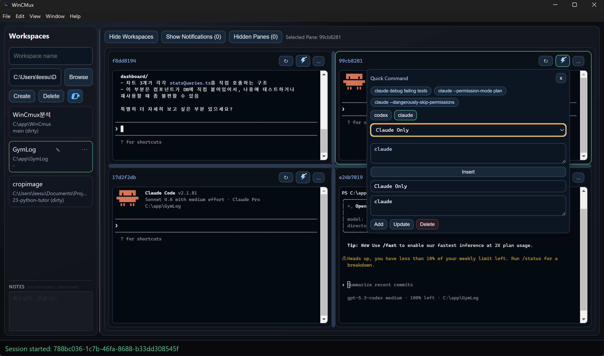

# WinCMux

Windows에서 여러 AI CLI 에이전트를 동시에 돌리기 위한 터미널 워크스페이스 멀티플렉서입니다.

WinCMux는 Electron, Node.js, ConPTY, `node-pty`로 만들어졌습니다. Claude Code, OpenAI Codex 같은 CLI 에이전트를 여러 작업 폴더와 pane에서 나눠 실행하고, 세션 상태와 알림, 작업 문서 전달 흐름을 한 화면에서 다루는 데 초점을 둡니다.

[English README](README.md)



## 왜 만들었나

macOS/Linux에는 `tmux`, `cmux` 같은 도구가 있지만 Windows에서 AI CLI를 여러 개 안정적으로 나눠 다루는 경험은 부족합니다. WinCMux는 다음 흐름을 목표로 합니다.

- 워크스페이스별 터미널 pane 관리
- 작업 폴더, 레이아웃, 세션 상태 유지
- pane 분할, 이동, 숨김, 그룹화
- Claude/Codex 응답 완료 알림
- 워크스페이스 메모와 git 상태 확인
- agent 설정/지시 파일 점검
- 긴 텍스트와 이미지를 파일 자산으로 저장한 뒤 경로 기반으로 전달

## 빠른 시작

필요한 환경:

- Windows 11 x64
- Node.js 20 이상
- npm 10 이상

저장소 루트에서 실행합니다.

```bat
.\dev.bat
```

수동 실행:

```bash
npm install
npm run dev
```

패키지를 따로 실행해야 할 때:

```bash
npm --workspace @wincmux/core run dev
npm --workspace @wincmux/desktop run dev
```

## 주요 사용 흐름

상세 참고 문서:

- [기능 상세](docs/features.md)
- [아키텍처와 IPC 메모](docs/architecture.md)
- [Roadmap](ROADMAP_NEXT.md)

### Workspaces

왼쪽 사이드바에서 작업 폴더를 관리합니다. `Add workspace`는 접힌 폼으로 되어 있고, 필요할 때 펼쳐서 새 워크스페이스를 추가합니다.

워크스페이스 목록은 `Brief`와 `Detail` 모드를 지원합니다. 긴 경로는 한 줄로 말줄임 처리되고, 각 워크스페이스는 별도 메모를 가질 수 있습니다.

워크스페이스 정보 팝업에서 볼 수 있는 항목:

- 설명
- git 요약
- 긴 파일 스캔
- AI 세션 기록
- 실행 중인 PTY 세션
- Agent Assets
- Input Assets

### Panes

Pane은 터미널 세션이 붙는 화면 단위입니다.

- 오른쪽 분할: `Ctrl+Alt+\`
- 아래 분할: `Ctrl+Alt+-`
- 선택 pane 이동: `Ctrl+Alt+P`
- 선택 pane 숨김: `Ctrl+Alt+W`
- 선택 pane 닫기: `Ctrl+Alt+Q`
- 선택 pane 재시작: `Ctrl+Alt+R`
- 분할 비율 균등화: `Ctrl+Shift+E`

pane 이동은 레이아웃만 바꾸며, 연결된 터미널 세션은 재시작하지 않습니다.

### Pane Groups

모든 워크스페이스에는 `Default` 그룹이 있습니다. 그룹 바에서 새 그룹을 만들고, pane 헤더의 그룹 pill에서 pane을 다른 그룹으로 옮길 수 있습니다. `All`은 해당 워크스페이스의 모든 pane을 보여줍니다.

### Agent Assets

Agent Assets는 워크스페이스 안의 AI 도구 설정/지시 파일을 Explorer를 열지 않고 확인하는 기능입니다.

지원 대상:

- Claude
- Codex
- Gemini
- Cursor
- Kiro
- opencode
- Shared MCP assets

대표적으로 `CLAUDE.md`, `AGENTS.md`, `GEMINI.md`, `.cursor/rules`, `.claude/skills`, `.kiro`, `.gemini`, `.opencode`, `.mcp.json` 등을 provider별로 모아서 보여줍니다.

일부 루트 지시 파일과 규칙 파일은 앱 안에서 수정할 수 있습니다. 설정 JSON, skills, subagents, 대부분의 생성 폴더는 안전을 위해 읽기 전용으로 다룹니다.

### Input Assets

Input Assets는 긴 붙여넣기나 이미지를 `.wincmux/input-assets` 아래에 저장하고, 터미널에는 파일 경로가 포함된 짧은 작업 지시문만 넣는 기능입니다.

지원 입력:

- 약 `2KB` 이상 또는 `20`줄 이상 긴 텍스트 붙여넣기
- 클립보드 이미지
- 이미지 파일 import

저장 위치:

- 텍스트: `.wincmux/input-assets/snippets/`
- 이미지: `.wincmux/input-assets/images/`

이미지 파일 import는 원본 확장자를 유지하고, 클립보드 이미지는 PNG로 저장합니다.

`Save + Insert`, `Insert`, `Copy`는 원문 전체나 이미지 바이너리를 pane에 넣지 않고 저장된 파일의 절대 경로를 포함한 작업 지시문을 사용합니다. `Path`는 파일 경로만 넣습니다.

텍스트 asset 삽입 형식:

```text
작업 문서 경로: C:\path\to\workspace\.wincmux\input-assets\snippets\<id>.md
위의 경로에 적힌 작업 문서로 작업 진행해줘
```

이미지 asset 삽입 형식:

```text
이미지 작업 문서 경로: C:\path\to\workspace\.wincmux\input-assets\images\<id>.png
위의 경로에 적힌 이미지 작업 문서로 작업 진행해줘
```

루트 `.wincmux/`는 저장소 `.gitignore`에 포함되어 있고, 각 워크스페이스의 `.wincmux/.gitignore`도 `input-assets/`를 무시합니다.

### Notifications

WinCMux는 Claude/Codex 터미널 출력에서 응답 완료 상태를 감지해 unread notification을 만듭니다. 알림은 워크스페이스별로 묶이고, 지원되는 환경에서는 Windows toast와 taskbar badge에도 반영됩니다.

## 저장소 구조

```text
WinCMux/
├── apps/desktop/      # Electron main, preload, renderer
├── packages/core/     # JSON-RPC core, SQLite, node-pty, layout/session engine
├── bridge/            # 프로토콜 문서와 schema
├── infra/             # 설정과 migration 참고 자료
├── scripts/           # 개발 보조 스크립트
├── assets/            # 스크린샷과 앱 assets
└── legacy-dotnet/     # 이전 .NET 구현 참고용
```

## 개발 확인 명령

push 전에 자주 쓰는 확인 명령입니다.

```bash
npm --workspace @wincmux/core run test -- --run
npm --workspace @wincmux/core run build
npm --workspace @wincmux/desktop run check:renderer
npm --workspace @wincmux/desktop run lint
npm run build
```

`check:renderer`의 line-count 경고는 참고용입니다. 문법 오류나 build 실패는 반드시 수정해야 합니다.

## 패키징

```bash
npm run package:win
```

이 명령은 NSIS 설치 마법사 방식의 Setup 파일을 만듭니다.

```text
apps/desktop/dist/WinCMux-Setup-<version>.exe
```

패키징된 앱은 WinCMux core 프로세스를 자동으로 실행합니다. 설치 파일에는 core runtime 파일과 `node-pty`, `better-sqlite3`에 필요한 native 터미널/DB 의존성이 포함됩니다. 따라서 별도 터미널에서 core를 켜지 않아도 desktop 앱이 `\\.\pipe\wincmux-rpc` JSON-RPC pipe를 만들고 연결할 수 있어야 합니다.

Setup 파일을 배포하기 전에 다음 흐름을 확인합니다.

```bash
npm run lint
npm run package:win
```

그 다음 `apps/desktop/dist/win-unpacked/WinCMux.exe`를 실행해 workspace 생성이 되는지 확인합니다. core 시작 상태는 `%LOCALAPPDATA%\WinCMux\logs\core.log`에서 볼 수 있습니다.

## 런타임 경로

| 항목 | 기본 경로 |
|---|---|
| Database | `%APPDATA%\WinCMux\wincmux.db` |
| 성능 로그 | `%LOCALAPPDATA%\WinCMux\logs\perf.jsonl` |
| Main 프로세스 로그 | `%LOCALAPPDATA%\WinCMux\logs\main.log` |
| Core 프로세스 로그 | `%LOCALAPPDATA%\WinCMux\logs\core.log` |
| Named pipe | `\\.\pipe\wincmux-rpc` |

상태 표시줄에 `Error: connect ENOENT \\.\pipe\wincmux-rpc`가 보이면 desktop 프로세스가 core RPC pipe에 연결하지 못한 상태입니다. 먼저 `main.log`와 `core.log`를 확인하세요. 두 로그에는 core entrypoint, 실행 runtime, 시작 출력, crash/respawn 정보가 기록됩니다.

## 최근 런타임 개선

- xterm 출력은 이전 write가 끝난 뒤 다음 chunk를 쓰도록 순차 flush해 큰 출력에서 write queue가 겹치지 않게 했습니다.
- renderer 출력 버퍼는 문자열 concat/slice 대신 chunk queue를 사용해 대량 터미널 출력 중 copy와 GC 부담을 줄였습니다.
- renderer pane 출력 큐는 반복 `Array.shift()` 대신 head pointer로 chunk를 소비해 다중 터미널 burst를 더 가볍게 drain합니다.
- workspace/pane tail 복원 중 live stream 중복 제거는 선형 overlap scan을 사용해 화면 전환 직후 UI stall을 줄였습니다.
- notification stream UI 갱신은 animation frame 하나로 합쳐 알림 burst가 sidebar와 pane badge를 반복 리렌더하지 않게 했습니다.
- 터미널 출력 normalization은 깨진 escape marker 후보가 있을 때만 regex replace를 실행해 renderer/core detector의 chunk당 작업을 줄였습니다.
- notification list는 scroll 때마다 전체 DOM을 다시 만들지 않게 해 터미널이 바쁜 동안 불필요한 리렌더를 없앴습니다.
- renderer webContents가 destroyed 되면 persistent stream socket도 닫아 window lifecycle 변경 뒤 stale stream send가 남지 않게 했습니다.
- pane overflow와 quick command 메뉴는 high-priority body-level portal로 띄우고 소유 pane 경계 안으로 위치를 제한해 compact pane이나 split 경계에서 UI가 잘리거나 가려지지 않게 했습니다.
- popover와 modal overlay는 공통 z-index layer를 사용해 session picker, workspace info, shortcut, input asset prompt가 terminal pane이나 이전 pane menu 뒤에 숨지 않게 했습니다.
- assistant prompt notification은 `press enter`가 포함된 Codex/npm 업데이트 로그를 억제해 CLI 업데이트 중 반복 native toast 오탐을 막았습니다.
- pane binding refresh는 unread notification과 known session을 refresh당 한 번만 인덱싱해 pane마다 전체 목록을 다시 훑지 않게 했습니다.
- core stream event는 emit당 한 번만 직렬화하고 socket당 한 번만 전송해 subscription이 겹칠 때 중복 output을 피합니다.
- renderer terminal output flush는 공유 frame queue와 프레임당 pane budget을 사용해 많은 pane이 같은 프레임에 xterm write를 몰아넣지 않게 했습니다.
- notification target parsing은 notification row별로 캐시해 workspace, notification, pane badge 렌더에서 재사용합니다.
- renderer performance log는 IPC/file append 전에 batch로 묶어 input flush metric처럼 자주 찍히는 로그가 키 입력마다 IPC 부담을 만들지 않게 했습니다.
- tail 복원 중 모아 두는 live stream output도 제한 크기의 chunk queue로 바꿔 pane 재연결이나 화면 전환 중 반복 문자열 concat/slice가 생기지 않게 했습니다.
- main에서 renderer로 보내는 stream event는 짧은 IPC window로 batch하고, 같은 session의 인접 output은 전달 전에 합쳐 다중 터미널 부하에서 Electron IPC wake-up을 줄였습니다.
- renderer stream output routing은 session-to-pane lookup map을 캐시해 output event마다 pane 목록을 훑지 않게 했고, stale cache 검증은 유지했습니다.
- renderer session refresh는 running-session index를 한 번 만들어 pane binding, group badge, hidden pane, prompt fallback 경로에서 반복 filter/find/map 스캔을 줄였습니다.
- renderer prompt fallback detector는 ANSI 제거와 prompt regex scan 전에 가벼운 fast-path probe를 사용해 fallback을 켠 상태에서도 일반 command output은 detector 비용을 건너뜁니다.
- main/core socket line parsing은 cursor로 진행하고 chunk당 남은 tail만 한 번 slice해 JSON-RPC와 stream traffic 처리 중 문자열 복사를 줄였습니다.
- renderer fallback polling은 이전 `session.read`가 끝난 뒤 다음 read를 예약하고 pane별 stable jitter로 분산하며, 입력 직후에는 poll을 앞당겨 non-stream 모드에서도 동시 read spike 없이 응답성을 유지합니다.
- renderer IME textarea binding은 pane별 800ms timer 대신 focus와 제한된 mutation observer를 사용해 한글 조합 처리는 유지하면서 많은 터미널의 idle DOM polling을 없앴습니다.
- renderer PTY resize sync는 shared queue와 프레임당 pane budget을 사용해 split, equalize, window resize 직후 모든 pane이 동시에 resize RPC를 보내는 burst를 줄였습니다.
- split pane divider drag는 flex update를 `requestAnimationFrame`으로 묶어 pane 크기 조절 중 layout churn을 줄였습니다.
- core stream fan-out은 subscription을 topic과 workspace/session scope로 인덱싱해 session output batch마다 모든 subscription을 훑지 않고 matching socket으로 라우팅합니다.
- core AI resume detector는 current output batch에 resume 단서가 있을 때만 recent tail buffer를 복사해 일반 shell 출력에서 tail join 비용을 피하면서 split resume marker 감지는 유지합니다.
- core prompt/completion detector는 큰 output batch에서 ANSI normalization 전에 tail만 검사해 output 끝의 prompt 감지는 유지하면서 대량 터미널 burst 중 full-batch scan을 피합니다.
- core drain/tail 출력 버퍼도 제한 크기의 chunk buffer로 바꿔 PTY 출력이 들어오는 동안 반복 문자열 concat/slice가 일어나지 않게 했습니다.
- core stream batch는 flush 지연을 낮추고 큰 출력 burst는 즉시 flush해 interactive latency를 낮췄습니다.
- core notification/resume detector는 stream batch 단위로 실행하고 일반 shell 출력은 fast-path로 건너뛰어 다중 터미널의 regex 작업량을 줄였습니다.
- 터미널 입력 flush는 adaptive 방식으로 바꿔 Enter, escape/control sequence, 작은 키 입력은 즉시 보내고 큰 paste는 짧게 batch합니다.
- 기본 Windows shell은 profile/AutoRun 작업을 건너뛰도록 실행합니다(`pwsh`/PowerShell `-NoProfile`, `cmd.exe /d`). profile이 필요한 경우 custom command를 사용할 수 있습니다.
- shell 시작 변경 효과를 추측하지 않도록 session startup latency를 성능 로그에 기록합니다.
- 백그라운드 git status refresh는 최근 터미널 입력/출력이 있으면 미루고, 한 번에 workspace 하나만 확인해 활성 터미널과의 CPU/디스크 경쟁을 줄였습니다.
- pane fit과 resize 작업은 `requestAnimationFrame`으로 묶어 pane/사이드바 크기 조절 중 반복 layout 측정을 줄였습니다.
- 워크스페이스/그룹 전환 시 stream 출력은 해당 세션이 실제로 붙어 있는 visible pane에만 전달하고, tail 복원 중 들어온 live 출력은 중복 prefix를 제거합니다.
- 터미널 fit/resize는 DOM에서 떨어졌거나 아직 0px인 pane host를 건너뛰고, cols/rows가 바뀌지 않은 PTY resize RPC는 중복 전송하지 않습니다.
- Browse로 작업 폴더를 선택하면 비어 있는 workspace name을 선택한 폴더명으로 자동 채웁니다. 사용자가 직접 입력한 이름은 덮어쓰지 않습니다.
- 패키징 시 오래된 `dist/win-unpacked` 산출물이 `app.asar` 안에 들어가지 않도록 구성했습니다.
- NSIS setup은 일반 설치 마법사 방식(`oneClick=false`)으로 만들고, packaged core runtime resources를 포함합니다.

## Roadmap

[ROADMAP_NEXT.md](ROADMAP_NEXT.md)를 참고하세요.

## License

MIT
