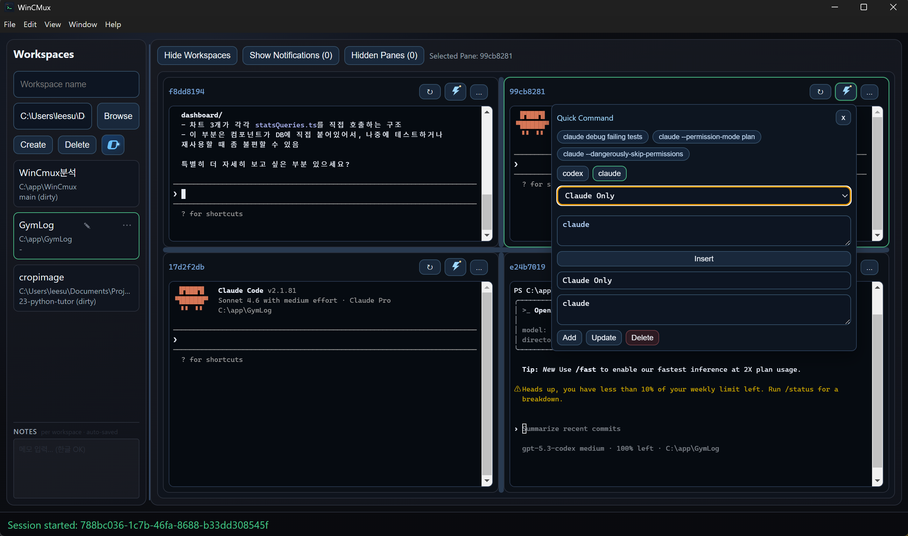

# WinCMux

Windows-first terminal workspace multiplexer for running multiple AI agent CLIs side by side.

WinCMux is built with Electron, Node.js, ConPTY, and `node-pty`. It is designed for Claude Code, OpenAI Codex, and other CLI agents that need separate working directories, persistent panes, notifications, and quick context handoff.

[Korean README](README.kr.md)



## Why

Tools like `tmux` and `cmux` are common on macOS/Linux, but Windows users need a native workflow that works well with AI CLI tools. WinCMux provides:

- multiple terminal panes per workspace
- workspace switching with preserved pane/session state
- grouped panes and visual pane move/drop
- unread notifications from assistant output
- workspace notes, git status, and session history
- agent instruction file inspection
- input asset handling for long text and images

## Quick Start

Requirements:

- Windows 11 x64
- Node.js 20+
- npm 10+

Run the app from the repository root:

```bat
.\dev.bat
```

Manual development commands:

```bash
npm install
npm run dev
```

Run packages separately:

```bash
npm --workspace @wincmux/core run dev
npm --workspace @wincmux/desktop run dev
```

## Main Workflows

More detailed reference docs:

- [Feature reference](docs/features.md)
- [Architecture and IPC notes](docs/architecture.md)
- [Roadmap](ROADMAP_NEXT.md)

### Workspaces

The left sidebar manages projects. Use the collapsible `Add workspace` form to add a folder, then switch between workspace cards. The list supports `Brief` and `Detail` display modes, and each workspace can keep its own notes.

The workspace info popup provides:

- description
- git summary
- long-file scan
- AI session history
- running PTY sessions
- Agent Assets
- Input Assets

### Panes

Panes are terminal surfaces backed by sessions.

- Split right: `Ctrl+Alt+\`
- Split down: `Ctrl+Alt+-`
- Move selected pane: `Ctrl+Alt+P`
- Hide selected pane: `Ctrl+Alt+W`
- Close selected pane: `Ctrl+Alt+Q`
- Restart selected pane: `Ctrl+Alt+R`
- Equalize splits: `Ctrl+Shift+E`

Moving a pane changes the layout tree without restarting the attached terminal session.

### Pane Groups

Each workspace starts with a `Default` group. Create more groups from the group bar, then move panes between groups from the pane group pill. `All` shows every pane in the workspace.

### Agent Assets

Agent Assets inspect workspace-scoped instruction/config files without opening Explorer.

Supported providers include Claude, Codex, Gemini, Cursor, Kiro, opencode, and shared MCP assets. Common files such as `CLAUDE.md`, `AGENTS.md`, `GEMINI.md`, `.cursor/rules`, `.claude/skills`, `.kiro`, `.gemini`, `.opencode`, and `.mcp.json` are grouped by provider.

Editable files are saved with workspace path checks and backup behavior. Tool settings, skills, subagents, and most generated folders remain read-only in the UI.

### Input Assets

Input Assets store user-provided materials under `.wincmux/input-assets` so you can send a path-based prompt instead of dumping large payloads into a terminal.

Supported inputs:

- long pasted text, detected at about `2KB` or `20` lines
- clipboard images
- imported image files

Text assets are saved under `.wincmux/input-assets/snippets/`. Image assets are saved under `.wincmux/input-assets/images/`; imported images keep their extension, and clipboard images are saved as PNG.

`Save + Insert`, `Insert`, and `Copy` use a short work prompt that points at the saved file. `Path` inserts only the file path.

Text prompt shape:

```text
작업 문서 경로: C:\path\to\workspace\.wincmux\input-assets\snippets\<id>.md
위의 경로에 적힌 작업 문서로 작업 진행해줘
```

Image prompt shape:

```text
이미지 작업 문서 경로: C:\path\to\workspace\.wincmux\input-assets\images\<id>.png
위의 경로에 적힌 이미지 작업 문서로 작업 진행해줘
```

`.wincmux/` is ignored by the repository, and each workspace input asset store creates its own `.wincmux/.gitignore` for `input-assets/`.

### Notifications

WinCMux watches assistant output and creates unread notifications when Claude/Codex responses appear complete. Notifications are grouped by workspace and mirrored to Windows toast/taskbar badge when supported.

## Repository Layout

```text
WinCMux/
├── apps/desktop/      # Electron main, preload, renderer
├── packages/core/     # JSON-RPC core, SQLite, node-pty, layout/session engine
├── bridge/            # Protocol notes and schemas
├── infra/             # Config and migrations
├── scripts/           # Development helpers
├── assets/            # Screenshots and app assets
└── legacy-dotnet/     # Old reference implementation
```

## Development Checks

Useful checks before pushing:

```bash
npm --workspace @wincmux/core run test -- --run
npm --workspace @wincmux/core run build
npm --workspace @wincmux/desktop run check:renderer
npm --workspace @wincmux/desktop run lint
npm run build
```

`check:renderer` can print line-count warnings for large renderer files. Treat syntax or build failures as blocking; line-count warnings are informational.

## Packaging

```bash
npm run package:win
```

## Runtime Paths

| Item | Default |
|---|---|
| Database | `%APPDATA%\WinCMux\wincmux.db` |
| Logs | `%LOCALAPPDATA%\WinCMux\logs` |
| Named pipe | `\\.\pipe\wincmux-rpc` |

## Roadmap

See [ROADMAP_NEXT.md](ROADMAP_NEXT.md).

## License

MIT
